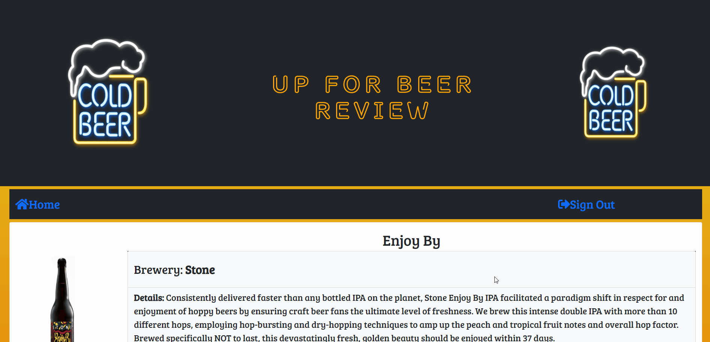

# Up For Beer Review

## Getting Started
Up For Beer Review was a collaborative project between Marko Sanchez, Javier Mondragon Fuentes, and Thomas Peeler. The concept for the project was a full stack application where the user would be able to interact with multiple “brews” or products, as well as make their own, and then write reviews for each one of those brews. Working agreements were established among the team and then each member branched off and started development on their respective tasks.

## Solving

The team began developing key features based on a set of user stories and outlined the work demanded for those features. Those pieces of work were divided amongst the team via github issue project cards. After having basic seeds, routes, and HTML, we began to merge and debug together. First the HTML was added via handlebars templates and then client side javascript was written to handle form submission for new brews, reviews, and login/logout. Models were then established with some database schema that changed back and forth through the cycle of development. Basic routing and seeds were also established for testing and improved upon later. Connection the database via mySQL also was written into the javascript connection that would later allow the project to be deployed to Heroku. Then express was used to instantiate the server and we began to merge and implement all of the features. Node was used to run seeding functions and run the server file. Anime js was later added for the animated logo feature later in the build as well as a full screen modal and other user validations. API research was done but never implemented for the user picture submit feature.

## Motivation
We wanted an application that is free to all users and easy user interface. We also wanted an application where a user is able to create a new beer to rate and write comments on existing beers.

## Site

## Technologies Used
*Handlebars - Used to create the visual layout of the site and create partials to hold database info
*JavaScript - Used to give site all real functionality and back end properties
*CSS - Used to give site an individual styling/aesthetic
*Nodejs - Used to be able to run all necessary processes through command line
*Heroku - Used to deploy site for public usage
*Github - Used to push all changes and edits made as well as hold separate branches for each team mates work
*Anime.js - Used to create animated logo on the page’s header
*Sequelize - Used to create models and control flow of data in the site
*mySQL - Used as the database to seed data into and hold all necessary information
*Express - Used for routing and creating connections between different processes and pages

## Deployed link on Heroku
https://upforbeerreview.herokuapp.com/

## Github repository
https://github.com/TMPeeler/Project-2

## Presentation Link
https://docs.google.com/presentation/d/1DyXHlB6Q43p1y5fZPBnZroX2XhEVhGFyI7skhsZerFE/edit?usp=sharing

## Authors
### Marko Sanchez
[Github](https://github.com/markosanchez800) 
[Linkedin](https://github.com/markosanchez800/)
### Thomas Peeler
[Github](https://github.com/TMPeeler)
### Javier Mondragon
[Github](https://github.com/javimarashall) 
[Linkedin](https://www.linkedin.com/in/javier-mondragon-7b471719b/)
